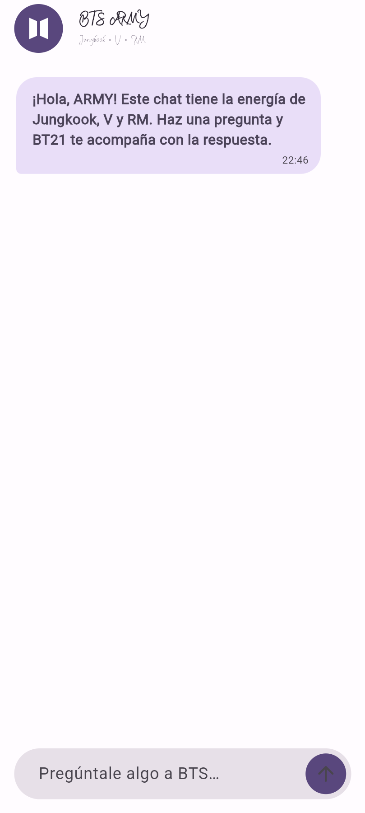
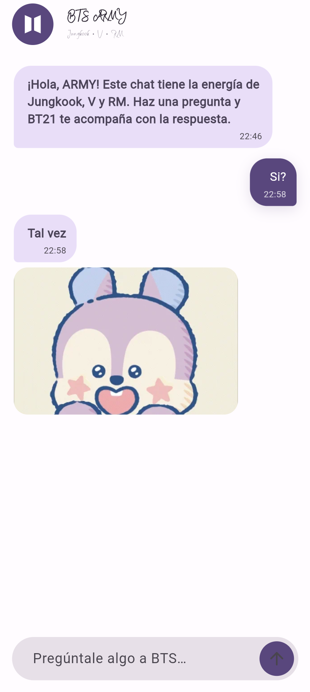
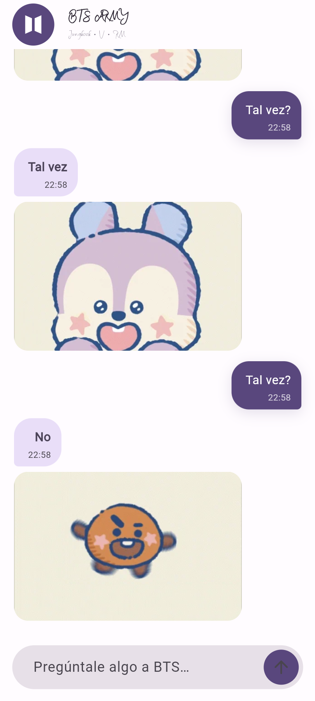
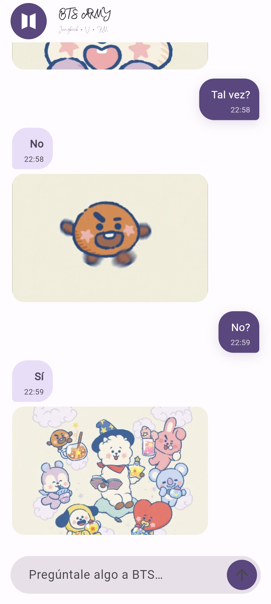

# Práctica 03: Sí, No, Maybe — Chat con API de respuestas automáticas

## Descripción

Aplicación de chat desarrollada en Flutter. Al recibir una pregunta terminada en `?`, consulta la API de [yesno.wtf](https://yesno.wtf/) y muestra una respuesta con su GIF animado.

## Aplicación desarrollada

La app responde **Sí (40 %)**, **No (40 %)** o **Tal vez (20 %)**. Las burbujas muestran la hora local y siguen un estilo de mensajería similar a WhatsApp. Incluye un ícono propio para Android y web.

La elección se realiza de forma independiente en cada pregunta, por lo que una conversación corta no necesariamente tendrá exactamente esas proporciones.

## Actividades realizadas

1. Se implementó la interfaz del chat y el envío de mensajes.
2. Se integró la API para obtener la respuesta y el GIF correspondiente.
3. Se añadió la selección ponderada 40/40/20 y la hora en cada mensaje.
4. Se personalizaron el ícono y la presentación de la aplicación.
5. Se preparó la publicación web en GitHub Pages.

## Archivos principales

- [Pantalla principal](lib/main.dart)
- [Estado y lógica del chat](lib/presentation/providers/chat_provider.dart)
- [Consulta a la API](lib/config/helpers/get_yes_no_answer.dart)
- [Entidad de mensaje](lib/domain/entities/message.dart)
- [Ícono de Android](android/app/src/main/res/drawable/ic_yes_no.xml)
- [Ícono web](web/icons/yes-no-icon.svg)

## Evidencias

### 1. Pantalla inicial BTS ARMY

Vista de bienvenida del chat con el emblema ARMY y el saludo inicial.



### 2. Respuesta con GIF de BT21

Ejemplo de una pregunta respondida por el chat junto con un personaje de BT21.



### 3. Conversación con respuestas automáticas

Intercambio de mensajes que muestra respuestas y GIFs de BT21 dentro de la conversación.



### 4. Varias respuestas de BT21

Captura de una conversación con diferentes respuestas y animaciones de BT21.



### 5. Icono ARMY instalado en el celular

Evidencia pendiente: aquí se agregará una captura de la pantalla de inicio del celular donde se vea el icono ARMY de la aplicación ya instalada.

> Espacio reservado para la captura del icono en el celular.

## Ejecución y pruebas

Desde el directorio de la aplicación:

```sh
flutter pub get
flutter run
flutter test
flutter analyze
```

La versión web necesita conexión a internet para consultar la API y cargar los GIF. El diagrama de arquitectura se publica en [GitHub Pages](https://koudionicio.github.io/Practicas_DMI_230237/practica03/yes_no_app/).

## Conclusión

La práctica integra una API externa, respuestas ponderadas y contenido multimedia en una interfaz de chat Flutter, con mensajes fechados y una versión web publicada.