# Práctica 04: TokTik — Feed de videos cortos

## Descripción

Aplicación desarrollada en Flutter que presenta videos locales en un feed vertical de pantalla completa. La navegación entre publicaciones se realiza deslizando hacia arriba o abajo.

## Aplicación desarrollada

Cada publicación reproduce su video en bucle y sin sonido. Al tocar el video se puede pausar o reanudar la reproducción. La interfaz muestra el título, los likes y las visualizaciones de cada clip.

Los videos se cargan desde `assets/videos/` y sus datos se definen localmente. El feed incluye 13 publicaciones.

## Actividades realizadas

1. Se implementó el feed vertical de videos con desplazamiento por páginas.
2. Se integró la reproducción de videos locales en pantalla completa.
3. Se añadieron controles de reproducción al tocar cada video.
4. Se mostraron el título, los likes y las visualizaciones de cada publicación.
5. Se organizaron los datos locales de los videos y se registraron sus recursos en Flutter.

## Archivos principales

- [Punto de entrada](lib/main.dart)
- [Pantalla de descubrimiento](lib/presentation/screens/discover/discover_screen.dart)
- [Estado y carga de publicaciones](lib/presentation/providers/discover_provider.dart)
- [Datos locales de videos](lib/shared/data/local_video_posts.dart)
- [Entidad de publicación](lib/domain/entities/video_post.dart)
- [Modelo para los datos locales](lib/infrastructure/models/local_video_model.dart)
- [Feed vertical](lib/presentation/widgets/shared/video_scrollable_view.dart)
- [Reproductor de pantalla completa](lib/presentation/widgets/video/fullscreen_player.dart)

## Evidencias

### 1. Feed de videos — Publicación 1

Vista inicial de la aplicación mostrando el primer video del feed junto con su título, likes y visualizaciones.

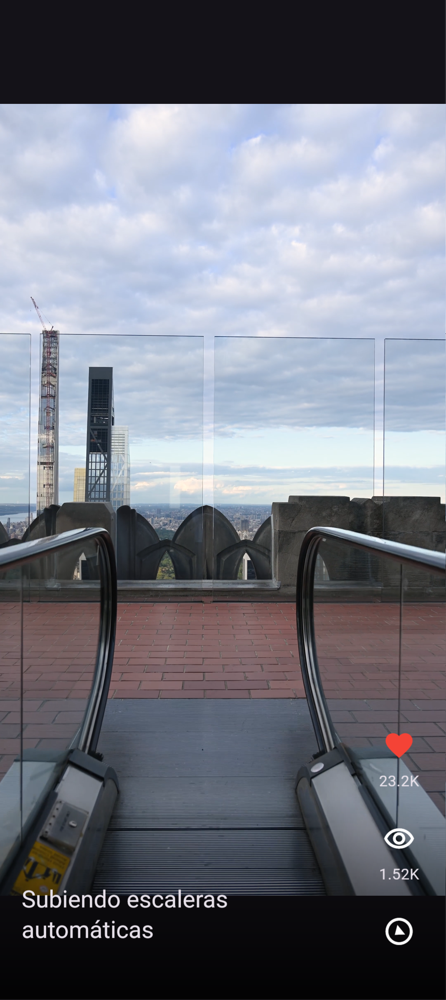

### 2. Feed de videos — Publicación 2

Segunda publicación del feed mostrando la reproducción del video y la información correspondiente.

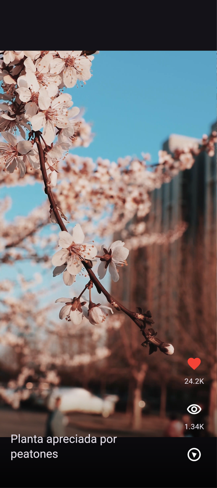

### 3. Feed de videos — Publicación 3

Tercera publicación mostrando el video local en pantalla completa y sus datos.

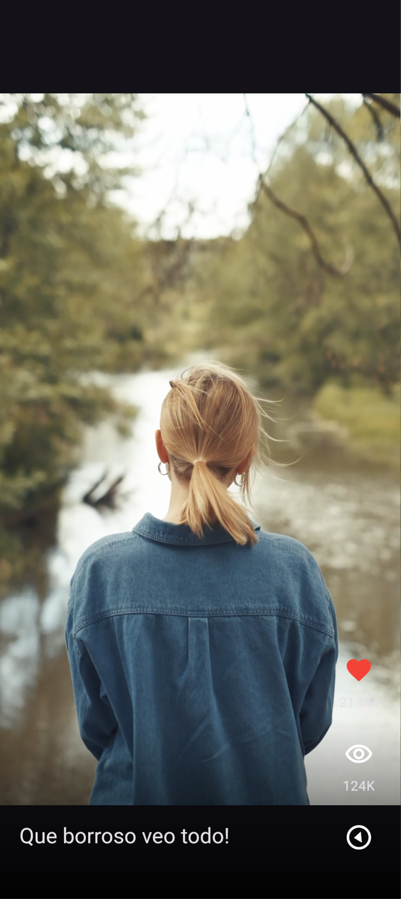

### 4. Feed de videos — Publicación 4

Cuarta publicación del feed con el título, likes y visualizaciones del video.

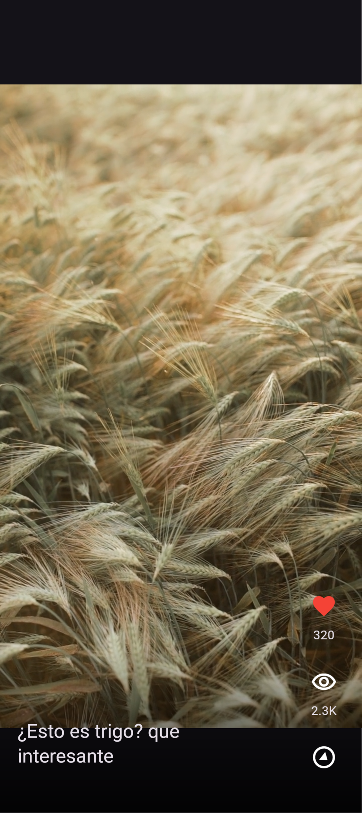

### 5. Feed de videos — Publicación 5

Quinta publicación mostrando la reproducción del video local dentro del feed vertical.


### 6. Feed de videos — Publicación 6

Sexta publicación del feed con sus datos de interacción y reproducción.


### 7. Feed de videos — Publicación 7

Séptima publicación mostrando otro de los videos locales incluidos en la aplicación.

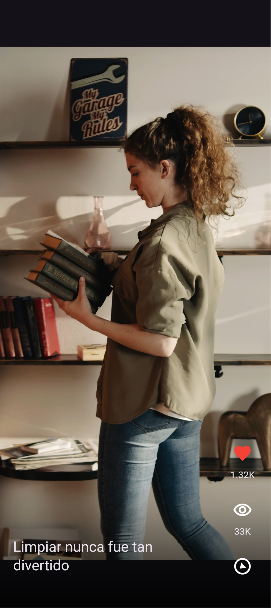

### 8. Feed de videos — Publicación 8

Octava publicación del feed mostrando el video y sus estadísticas.

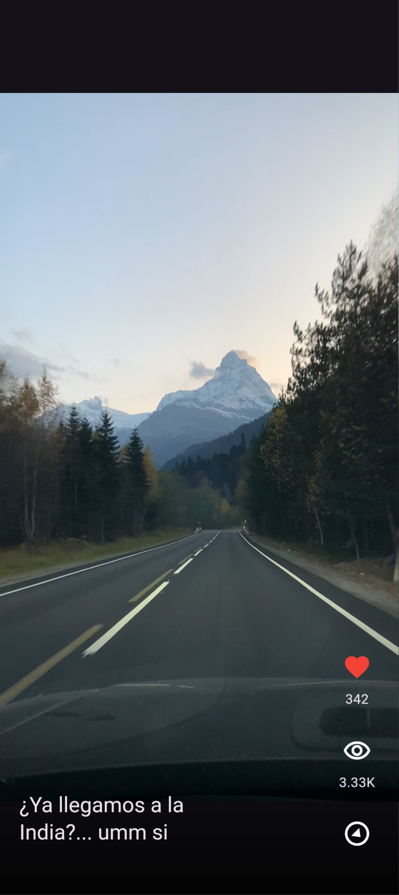

### 9. Una vuelta bajo las nubes

Publicación que muestra una rueda de la fortuna bajo un cielo nublado.

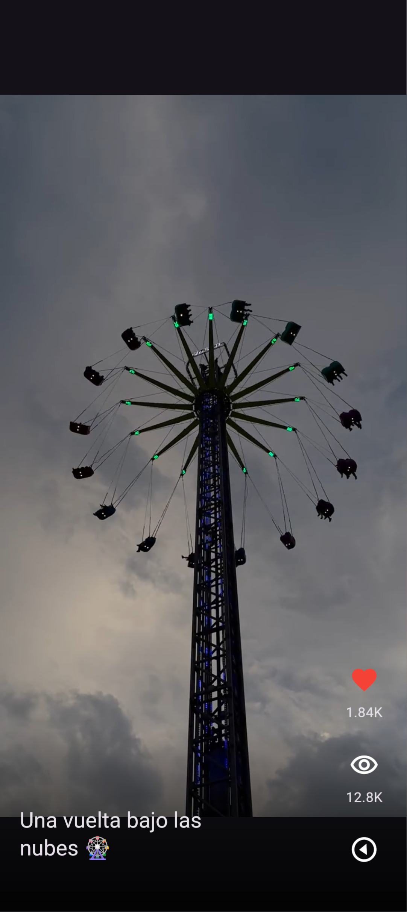

### 10. Luces de la ciudad por la noche

Publicación que muestra una avenida iluminada durante la noche.

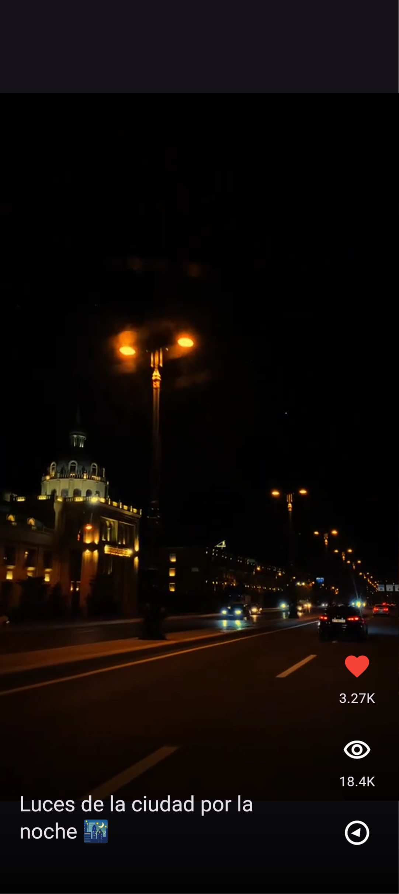

### 11. La ciudad desde las alturas

Vista nocturna de la ciudad mostrando sus edificios y calles iluminadas.

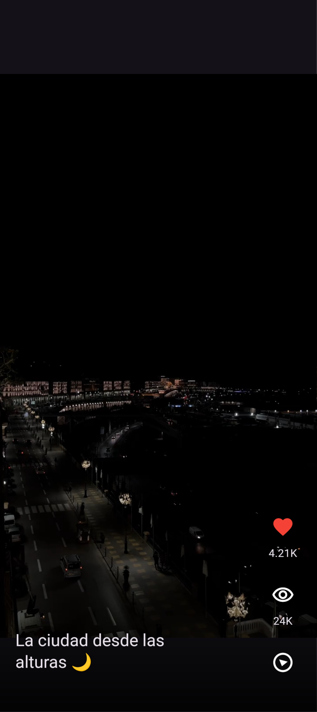

### 12. Un taxi entre los gigantes

Publicación nocturna donde se observa un taxi frente a los edificios de la ciudad.

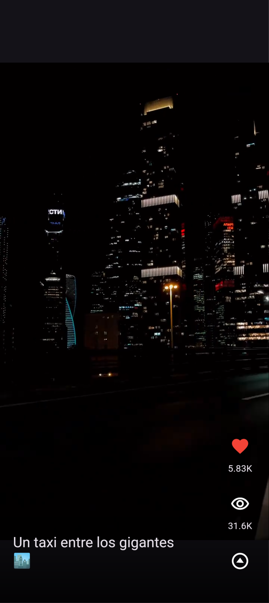

### 13. Una noche lluviosa en la ciudad

Publicación que muestra una calle durante la lluvia y los reflejos de las luces sobre el pavimento.

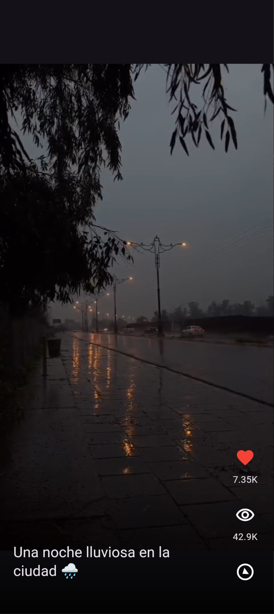

## Ejecución y pruebas

Desde el directorio de la aplicación:

```sh
flutter pub get
flutter run
flutter analyze
```

La aplicación utiliza los videos incluidos en `assets/videos/`; no requiere conexión a internet para reproducirlos.

## Conclusión

La práctica integra navegación vertical, reproducción local de video y presentación de datos de publicaciones en una aplicación Flutter. El feed cuenta con 13 publicaciones y permite interactuar con cada video mediante controles de reproducción.