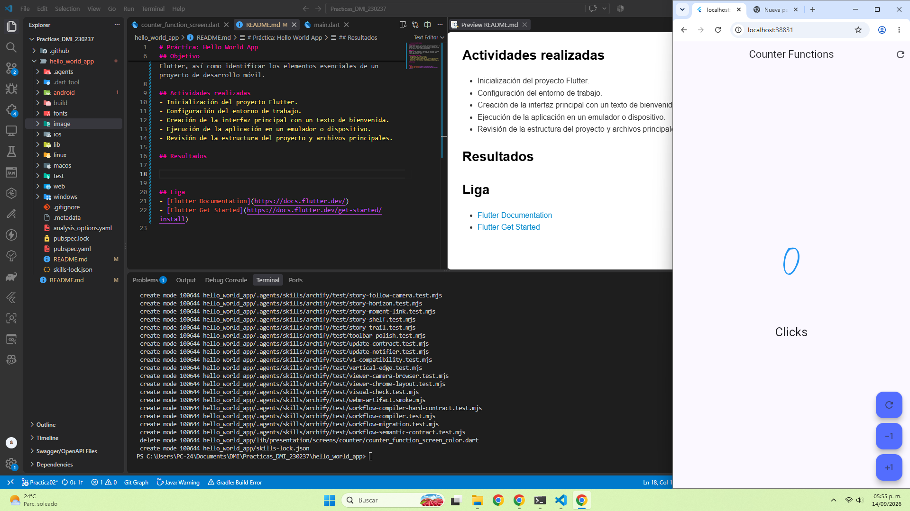
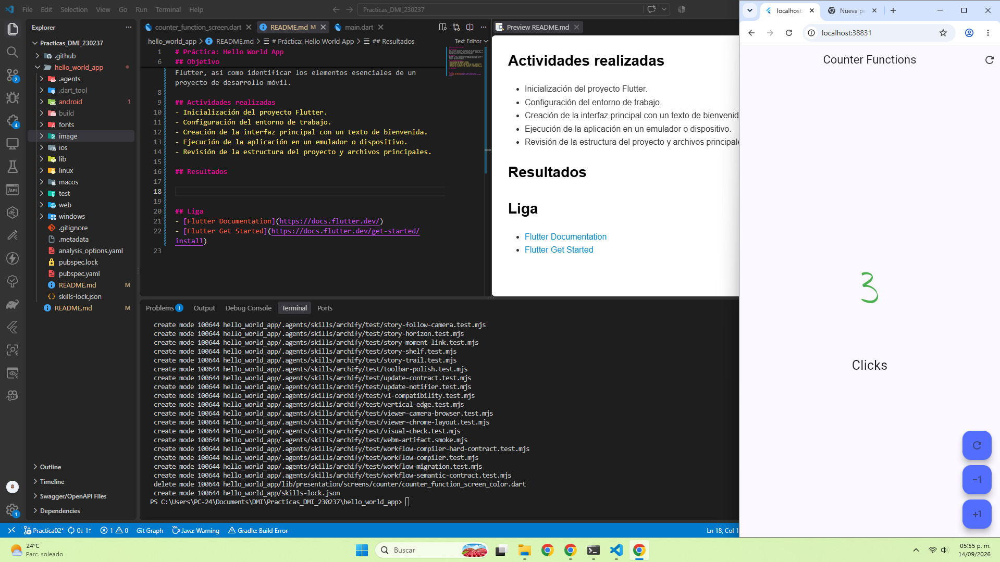

# Práctica: Hello World App

## Descripción
Esta práctica consiste en la creación de una aplicación básica en Flutter con el objetivo de familiarizarse con el entorno de desarrollo, la estructura de un proyecto móvil y la ejecución de una app sencilla en un dispositivo o emulador.

## Objetivo
Aprender a crear, ejecutar y comprender una aplicación mínima en Flutter, así como identificar los elementos esenciales de un proyecto de desarrollo móvil.

## Actividades realizadas
- Inicialización del proyecto Flutter.
- Configuración del entorno de trabajo.
- Creación de la interfaz principal con un texto de bienvenida.
- Ejecución de la aplicación en un emulador o dispositivo.
- Revisión de la estructura del proyecto y archivos principales.

## Resultados
Se creó una aplicación básica en Flutter con una interfaz funcional de prueba, se configuró el entorno de desarrollo y se verificó la ejecución del proyecto en un emulador o navegador.

## Capturas de pantalla

### 1. Contador en cero

En esta imagen se muestra la función counter en el número 0 en color azul, indicando el valor inicial antes de realizar alguna acción.

### 2. Números positivos

Aquí se observa cómo el contador aumenta y muestra valores positivos en color verde, representando el incremento del número.

### 3. Números negativos

En esta captura se muestra la disminución del contador con valores negativos en color rojo, evidenciando el decremento del número.

## Liga
- [Flutter Documentation](https://docs.flutter.dev/)
- [Flutter Get Started](https://docs.flutter.dev/get-started/install)
